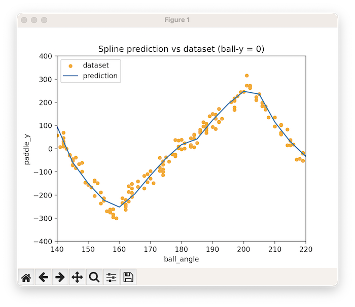
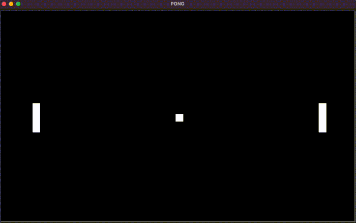

# Pong AI

This project aims to train a machine learning model to play the classic video game Pong.

To do this, I developed a Python script to play Pong and record all relevant metrics (such as paddle position and ball angle) to create a dataset. 
This dataset is then used to train the machine learning model using scikit-learn. 
The resulting model is able to predict the proper position of the AI-controlled paddle to hit the ball when the computer plays against a human player.

# How to use

1. Run `train.py` to start training the model. The script will automatically play Pong and record the necessary data to create the dataset. 
2. Once the dataset big enough (2000 to 3000 records recommended), run `learn.py` to train the machine learning model.
3. After the AI training, run `play.py` to play Pong against AI. 

# How it works

The project is composed by three script:

## Train

Training is based on a simple implementation of the classic game Pong using Python's turtle library. 
The game is played on a screen with two paddles and a ball. 
The ball bounces off the top and bottom edges of the screen, and when it hits one of the paddles, it bounces back and its angle is modified according to the position it hits on the paddle. 
For machine learning training purpose, both paddles are moved automatically, based on vertical position of the ball, with random variation to include variation of angle when hitting the ball.

In addition to the game logic, the code also includes functionality to store data on the ball's position and angle, as well as the right paddle's position, when the ball hits the right paddle. 
This data is stored in a CSV file called `dataset.csv`. The code also includes a loop that restarts the game after the ball hits the right paddle for training purposes.

## Learn

This script implements the machine learning model to predict the vertical position of the paddle in the game based on the initial vertical position and angle of a ball.

The code reads in a dataset from `dataset.csv` using pandas. The dataset is stored in a DataFrame called df. 
The features (inputs) for the machine learning model are the `ball_y` and `ball_angle` columns, and the target (output) is the `paddle_y` column. These columns are extracted and stored in separate variables X, y respectively.

The machine learning model is the Random Forest Regressor, which is implemented using the `RandomForestRegressor` class from `sklearn`. The model is trained using the fit method, and then the model is stored to disk using `joblib`.

After training and evaluating the model, a scatter plot is created using `matplotlib` to compare the model's predictions with the data in the dataset for a particular value of `ball_angle`. 

The model is then used to make a prediction for the target vertical position of the paddle, based on user input for the initial vertical position and angle of the ball. This prediction will be used at every iteraction during the game. 

## Play
The script is similar to `train` but in `play` it loads the machine learning model `spline_model` from `joblib` file to predict the position of the right paddle (controlled by AI) based on the position and angle of the ball whenhit by human player.

Use the keyboard to control the left paddle with 'e' key to move up and 'x' to move down.
The AI controlled right paddle will predict the position of the ball when it will arrive on its side and will place accordingly.

